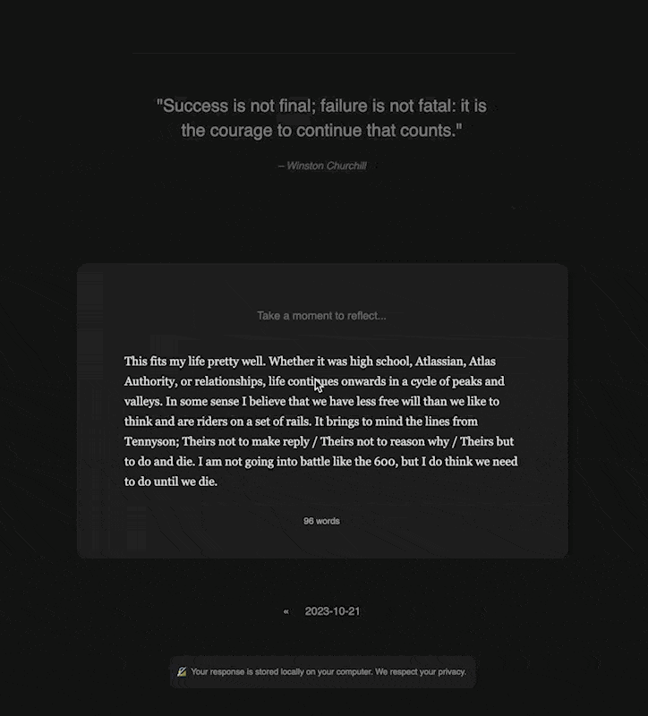

# Untitled Quote Reflection Extension

Daily quotes with prompts to push the user to reflect

As I am a terrible dev, this is mostly the work of ChatGPT. You can see the entire conversation at https://chat.openai.com/share/8453159a-5516-40f9-aec0-cea56e05824d

## Backend

I needed a simple backend so I used val.town for prototyping purposes. You can see the full code at https://www.val.town/v/boris.quoteResponder